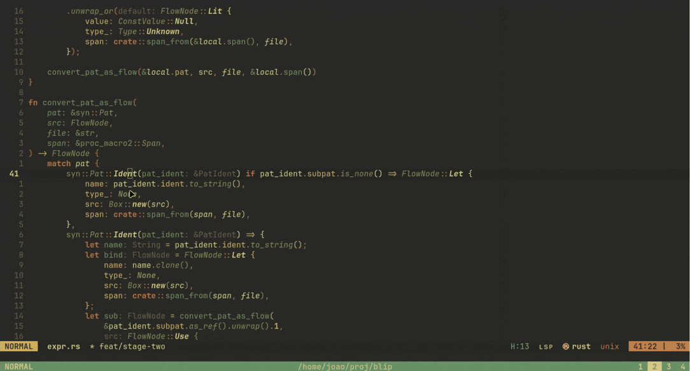

# blip



Blip is a tiny Neovim plugin for asking quick questions about the code under
your cursor. No chat buffers, no sessions, no state to manage — type a question,
read the answer streamed inline next to the relevant lines, dismiss it, and get
back to work.

- Minimal by design — `ask`, `dismiss`, and an optional `comment`
- Stateless — no sessions, no history, no buffers to clean up
- Your files stay clean — answers render as virtual text (extmarks)
- Works on a single line (normal mode) or a visual selection
- Can look around your codebase when it needs to
- Works with any OpenAI-compatible endpoint (OpenAI, Ollama, vLLM, ...)

## Why extmarks?

Blip's whole point is to ask a question and move on. By rendering answers as
virtual text, explanations never dirty your tracked files — no generated
comment lines, no git noise. `dismiss` wipes everything and your buffer is
exactly as you left it. The only time Blip touches your buffer is when you
explicitly ask it to with `comment()`.

## Requirements

- Neovim **0.10+**
- [plenary.nvim](https://github.com/nvim-lua/plenary.nvim) (required, for `plenary.curl`)
- `rg` (ripgrep) on your `PATH`
- An API key for an OpenAI-compatible chat completions endpoint

## Installation

<details>
<summary>lazy.nvim</summary>

```lua
{
    'joaosimsic/blip',
    dependencies = { 'nvim-lua/plenary.nvim' },
    -- config = function() ... end  -- see Configuration below
}
```
</details>

<details>
<summary>vim-plug</summary>

```vim
Plug 'nvim-lua/plenary.nvim'
Plug 'joaosimsic/blip'
```
</details>

<details>
<summary>packer.nvim</summary>

```lua
use {
    'joaosimsic/blip',
    requires = { 'nvim-lua/plenary.nvim' },
}
```
</details>

## Configuration

Call `setup()` exactly once with a `provider` table. The only required fields are
`base_url`, `model`, and one of `api_key` / `api_key_env`.

| Option | Type | Default | Description |
| --- | --- | --- | --- |
| `provider.base_url` | `string` | — | OpenAI-compatible base URL, e.g. `https://api.openai.com/v1` |
| `provider.model` | `string` | — | Model identifier, e.g. `gpt-4o-mini` |
| `provider.max_tokens` | `integer` | `8192` | Max tokens per request |
| `provider.api_key` | `string?` | `nil` | API key. Takes precedence over `api_key_env` if both are set |
| `provider.api_key_env` | `string?` | `nil` | Env var holding the API key. Fallback when `api_key` is not set |
| `max_tool_calls` | `integer` | `16` | Max rounds of codebase lookups before giving up |
| `max_read_lines` | `integer` | `100` | Default line range cap for `read_file_lines` |
| `debug` | `boolean` | `false` | Enable verbose `[Blip]` debug notifications |

### API key

At least one of `api_key` or `api_key_env` is required — otherwise `setup()`
aborts with an error. If both are set, `api_key` wins. Otherwise Blip falls back
to the environment variable named by `api_key_env`, which is read at request time
(so you can set it without restarting Neovim).

### Example config (lazy.nvim)

```lua
{
    'joaosimsic/blip',
    dependencies = { 'nvim-lua/plenary.nvim' },
    keys = {
        { '<leader>ba', function() require('blip').ask() end, desc = 'Blip: ask about code' },
        { '<leader>bc', function() require('blip').comment() end, desc = 'Blip: insert explanations as comments' },
        { '<leader>bd', function() require('blip').dismiss() end, desc = 'Blip: dismiss' },
    },
    opts = {
        provider = {
            base_url = 'https://api.openai.com/v1',
            model = 'gpt-4o-mini',
            api_key_env = 'OPENAI_API_KEY', -- fallback if api_key is not set
        },
        max_tool_calls = 16,
        max_read_lines = 100,
        debug = false,
    },
    config = function(_, opts)
        require('blip').setup(opts)
    end,
}
```

### OpenAI

```lua
require('blip').setup({
    provider = {
        base_url = 'https://api.openai.com/v1',
        model = 'gpt-4o-mini',
        api_key_env = 'OPENAI_API_KEY',
    },
})
```

### Ollama (local)

```lua
require('blip').setup({
    provider = {
        base_url = 'http://localhost:11434/v1',
        model = 'qwen2.5-coder',
        -- api_key_env = 'OLLAMA_API_KEY', -- or a dummy key; Ollama ignores it
    },
})
```

## Usage

1. Put your cursor on a line (normal mode) or make a visual selection.
2. Run `:lua require('blip').ask()` (bind it to a key, see above).
3. A `Prompt:` line appears inline — type your question and press `<CR>`.
4. The model streams its answer as virtual text next to the relevant lines.
   Press `<C-c>` during the prompt to cancel.
5. When you're done, `:lua require('blip').dismiss()` clears all virtual text.

### Response format

The model addresses each explained line with a `L<line>: explanation` tag. Lines
matching that format are rendered next to their numbered source line; anything
else is distributed sequentially across the selection.

### Codebase lookups

When a question needs more context, the model can search and read your codebase
with a few tools (`search_code`, `read_file_lines`, `list_directory`). These
only run inside your project root, resolved from the current buffer's git root
or `cwd`.

### Committing explanations

By default Blip never writes to your files. If you want the explanations to
stick, `:lua require('blip').comment()` inserts them as real comments in the
buffer (skipping lines that already have one).

## Health

Run `:checkhealth blip` to verify dependencies, configuration, and API key.

## Development

```sh
make test          # run plenary tests (requires the plenary submodule)
make format        # stylua lua/ tests/
make check-format  # stylua --check
make lint          # luacheck
```
